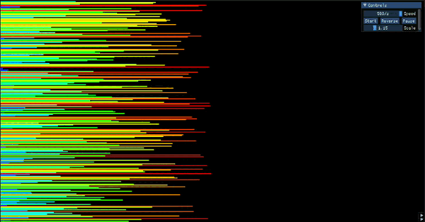

<!-- ahokcool HEADER START-->
---

   
  An overview of all my projects can be found here: <a href="https://github.com/ahokcool/ahokcool/blob/main/README.md" target="_blank">ahokcool</a>  
   
  This project was created as part of my studies at: <a href="https://www.42lisboa.com" target="_blank">42 Lisboa</a> 

---
<!-- ahokcool HEADER END-->
<!-- PROJECT HEADER START -->
 

  
  <h1 align="center">push_swap</h1>

    The idea of the fdf project, French "fil de fer" for "wireframe model", is to visualise wireframe models. This is done by reading a map with 3-D coordinates from a file and storing it in a linked list. These 3D coordinates are then transformed into 2D coordinates according to the user's preferences and displayed in a window.

 
<!-- PROJECT HEADER END -->

## :bulb: Lessons learned
